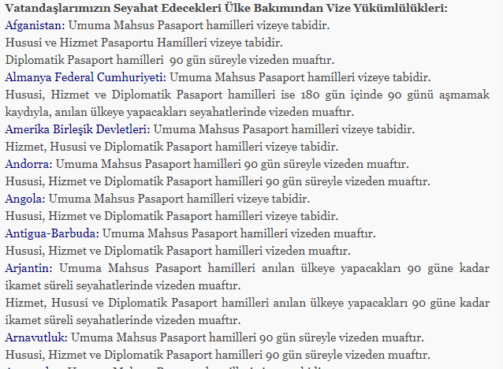
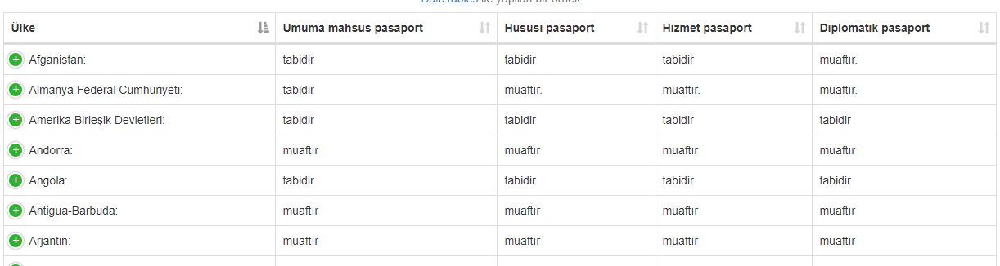

# Visa uygulamaları

Live version : 
https://a0m0rajab.github.io/VizeUygulamalari/

## Table of content

<!-- TOC -->

- [Visa uygulamaları](#visa-uygulamalar%C4%B1)
    - [Table of content](#table-of-content)
    - [English](#english)
        - [motivation](#motivation)
        - [Briefly](#briefly)
        - [Story](#story)
    - [Turkish (Türkçe)](#turkish-t%C3%BCrk%C3%A7e)
        - [Kısaca](#k%C4%B1saca)
        - [Amaç](#ama%C3%A7)
        - [Yenilikler](#yenilikler)
        - [not](#not)
    - [Arabic (عربي)](#arabic-%D8%B9%D8%B1%D8%A8%D9%8A)
    - [before - after](#before---after)
        - [Before](#before)
        - [After](#after)
    - [To Do](#to-do)

<!-- /TOC -->

## English

### motivation

"Complaining want Solve a problem"

### Briefly

a table to show Visa applications for turkish citizens in a modern way.

### Story

It's all started with a challenge driven by prof. maeyler at (course name) course when he asked us to develop an educational site for one of the topics that we learnt at that course.
I found the Data tables library but could not use it in my site since i did not need that but when i checked the government site for visas i said : hooray, i can use it.

After using the table and editing the data to make it more friendly i sent the site to the government to use it.

## Turkish (Türkçe)

### Kısaca

Visa uygulamaların gösterimi geliştirmesi.

### Amaç

Vatandaşın resmi siteleri kullanması kolaylaştırma imkanı göstermesi.

### Yenilikler

1. Arama

    ister devletlerde isterde açıklamalarda ve muafiyet durumuna göre arama yapılır.

2. Sıralama

    belli bir sütün seçerek onun bilgileri sıralması.  

3. Gösterimi

   telefonlara uygun olan bir tasarım hemde bilgieri daha kolay ve anlayışlı bir şekilde gösterildi.

### not
Türk Vatandaşlarının Tabi Olduğu Vize Uygulamaları bilgileri Direkt Dişişleri bakanlığı Sitesinden Çeikildi.

## Arabic (عربي)

التذمر لا يمكن حل اي مشكلة

مثال لاستخدام مكتبة

DataTables

لعرض البيانات الخاصة بالفيزا للمواطنين الاتراك

## before - after

### Before

### After

## To Do

- [x] Draw the table
- [x] Show before and after
- [x] write about the journey
- [ ] Add comparison between pasports
- [ ] Add map visualisation for each pasport